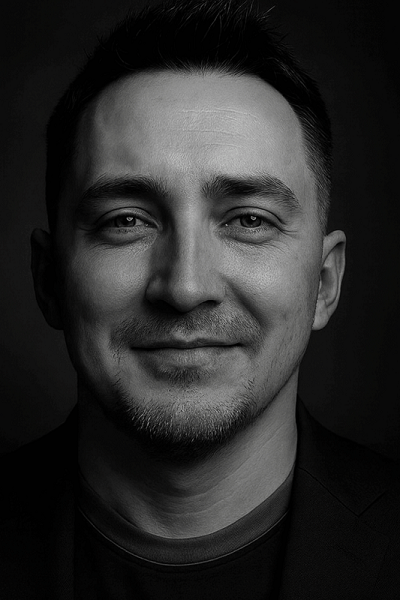

<table>
  <tr>
    <td style="vertical-align: top; padding-right: 16px;">
      <h1>👋 Привет, я Павел</h1>
      
🚀 <strong>Head of DevOps Engineer @ Magnit Tech</strong> 
      💻 Делаюсь опытом в DevOps, SRE и автоматизации 
      📍 Saint-Petersburg

      

        
        
      

    </td>
    <td style="width:240px; text-align:center; vertical-align:middle;">
      
    </td>
  </tr>
</table>

## 🧑‍💻 Обо мне
- 2011–2019 — System Administrator  
- 2019–2022 — Head of Technical Support, **SberSolutions**  
- 2022–2023 — DevOps Engineer, **SberSolutions**  
- 2023–2024 — DevOps Engineer, **SberTech**  
- 2024–2025 — Team Lead DevOps Engineer, **SberTech**  
- Now — Head of DevOps Engineer, **Magnit Tech**  

---

## 🛠 Технологии и инструменты  

<!-- Core -->

<!-- CI/CD & Collaboration -->

<!-- Containers & Orchestration -->

<!-- IaC & Secrets -->

<!-- Monitoring & Observability -->

<!-- Databases -->

<!-- Messaging -->

<!-- Big Data -->

<!-- Virtualization -->

---

## 📚 Подборки и шпаргалки
- ⚡ [from Zero to DevOps Hero](https://github.com/b4shninja/b4shninja/tree/main/courses/from_zero_to_devops_hero)
- 📄 [Cheat-sheets](https://github.com/b4shninja/cheat-sheet-pdf)  
- ⚡ [DevOps Exercises](https://github.com/b4shninja/devops-exercises)  
- 🛠 [Ansible Tuto (RU)](https://github.com/b4shninja/ansible-tuto-rus)  
- 📘 [DevOps Netology](https://github.com/b4shninja/devops-netology)  

---

## 📡 Где меня читать
- 📰 **Дзен**: https://dzen.ru/devops  
- 💬 **Telegram**: https://t.me/b4shninja  

---

## 📊 GitHub Статистика

---

## ⚡ Fun fact
> «Автоматизация — это искусство лени. Сделай один раз правильно, чтобы больше никогда не повторять вручную.» 😎
